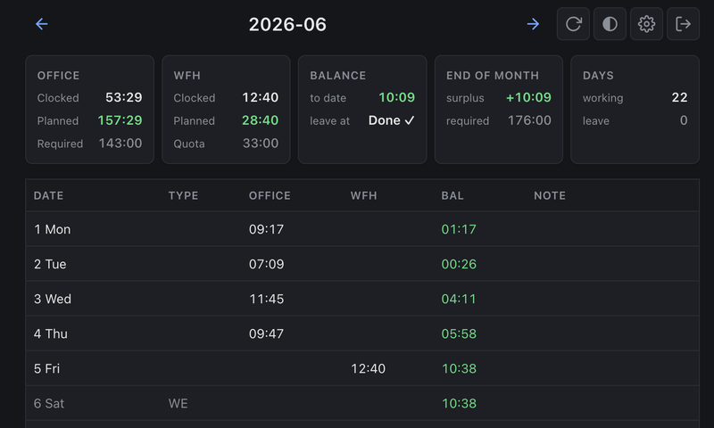
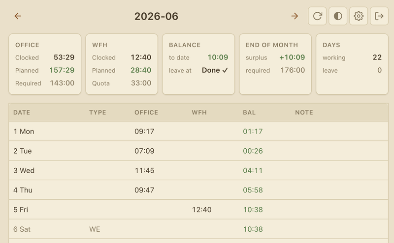

# praison

Self-hosted web app for planning your hours on a Praise time-tracking instance: plan future office / WFH / leave days and see a live monthly projection against your workplace rules.

| Dark | Light |
| --- | --- |
|  |  |

## Run with Docker (recommended)

```bash
docker compose up
```

That's the whole setup — one command, no files to mount, no keys to generate. Open <http://localhost:24601>, then sign in with your **Praise URL + email + password**. The encryption key and Postgres data are created once and persist in named Docker volumes.

## Run locally

```bash
make setup
make run          # http://localhost:24601
```

Local mode stores everything (SQLite database, encryption key) under `~/.config/praison/`.

## Settings

Per-user options live behind the ⚙ button:

- **Hours per day** — your daily working-hour target.
- **WFH hours per business day** — your remote-work allowance per business day.

## Development

```bash
make test
make lint
make lint/fix
```

## License

[WTFPL](LICENSE) — do what the fuck you want to.
